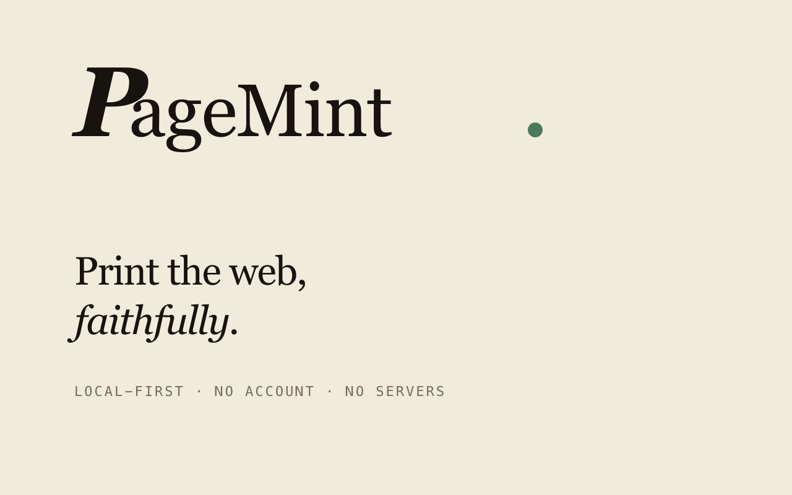
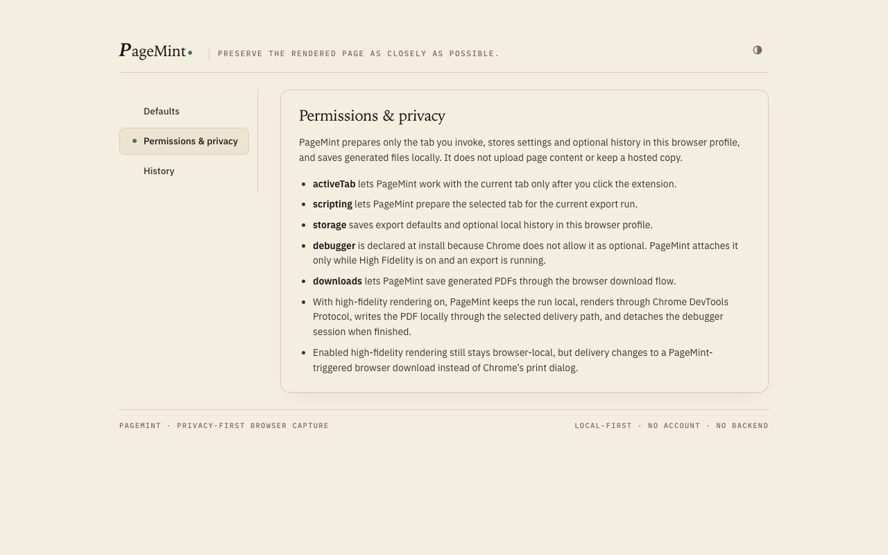
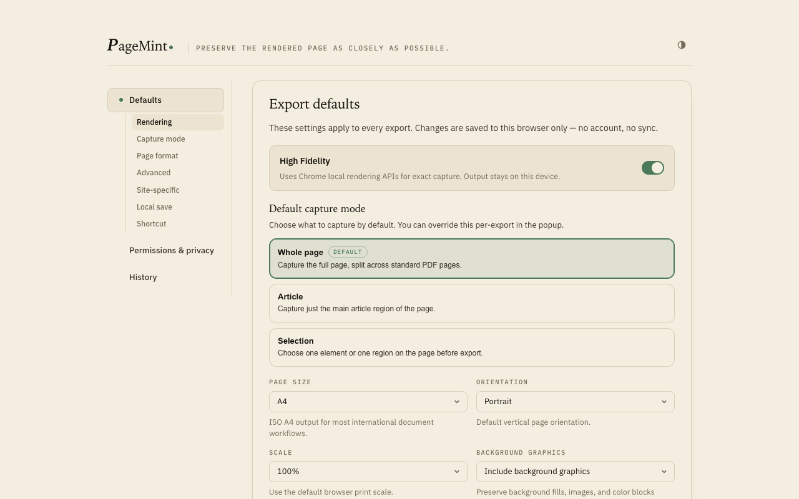
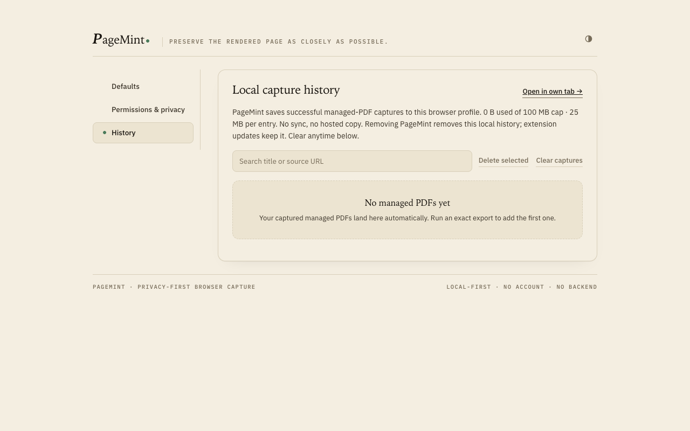

<div align="center">

<picture>
  <source media="(prefers-color-scheme: dark)" srcset="apps/site/public/brand/night-1024.svg">
  
</picture>

# PageMint

### Save any web page as a **trustworthy PDF**. Locally. Free. Open source.

*A small press for the web.*

[](LICENSE)
[](https://chromewebstore.google.com/detail/pagemint/clkeafinfphgcfhenakanegeibknecbm)
[](#-privacy-you-can-verify)
[](https://www.typescriptlang.org/)
[](https://nextjs.org/)
[](https://pnpm.io/workspaces)

[Install on Chrome](https://chromewebstore.google.com/detail/pagemint/clkeafinfphgcfhenakanegeibknecbm) · [Website](https://pagemint.space) · [Trust & permissions](https://pagemint.space/trust) · [Report an issue](https://github.com/orangebread/pagemint/issues)

</div>

<br>

<div align="center">
  
</div>

---

## ✨ Why PageMint?

Chrome's print-to-PDF breaks on the pages you actually need to save. Logged-in dashboards. Long receipts. Multi-page reports. Dynamic pages that load as you scroll.

**PageMint captures all of them in one click — locally, on your device, with no account, no upload, no telemetry.**

Every line of code is in this repo. Every claim is verifiable.

<div align="center">
  
</div>

---

## 🚀 Features

| | |
|---|---|
| 🔑 **Logged-in pages** | Bank statements, finance dashboards, GA4 reports, Notion pages — anything behind a login wall. |
| 🎯 **High Fidelity mode** | Uses Chrome DevTools Protocol locally to render pages exactly as you see them. No cut-off charts, no broken layouts. |
| 🔒 **100% local-first** | Page content, screenshots, and PDFs never leave your device. No servers in the product path. |
| 📖 **Open source** | MIT-licensed. Read it, fork it, ship your own build, audit the network behavior yourself. |
| ✂️ **Selection capture** | Highlight a section of the page and save just that — not the whole document. |
| 📜 **Local history** | Every PDF you've saved, searchable and re-exportable from your toolbar. |
| ⚙️ **Full export control** | Paper size, margins, scaling, page breaks, headers — tune once, save your defaults. |
| 🧹 **Remove elements** | Strip cookie banners, ads, or anything else before you capture. Session-local, never persisted. |

---

## 🖼️ A look inside

<table>
  <tr>
    <td align="center" width="33%">
      <br>
      <sub><b>Permissions baseline</b> — three permissions, gated and on demand.</sub>
    </td>
    <td align="center" width="33%">
      <br>
      <sub><b>Export defaults</b> — paper, margins, scaling, headers.</sub>
    </td>
    <td align="center" width="33%">
      <br>
      <sub><b>Local history</b> — every PDF, searchable from the toolbar.</sub>
    </td>
  </tr>
</table>

---

## 📦 Install

### From Chrome Web Store (recommended)

[**→ Install PageMint**](https://chromewebstore.google.com/detail/pagemint/clkeafinfphgcfhenakanegeibknecbm)

### From source

```bash
git clone https://github.com/orangebread/pagemint.git
cd pagemint
pnpm install
pnpm --filter @pagemint/extension build
```

Output lands in `apps/extension/.output/chrome-mv3`. In Chrome:
1. Open `chrome://extensions`
2. Toggle **Developer mode**
3. Click **Load unpacked**, point at `apps/extension/.output/chrome-mv3`

---

## 🛡️ Privacy you can verify

PageMint has **no hosted rendering, telemetry, account, checkout, support-intake, admin backend, or server-side feature gating** in the open-source product.

- Page content, rendered PDFs, settings, and optional history stay in the browser profile where PageMint is installed.
- No third-party analytics. No phone-home. No usage pings.
- The `debugger` permission is declared up front, gated behind a toggle, and attached only on demand.

Because the source is public, this isn't a promise — it's something you can check. Open the DevTools network tab. Grep the source. Run a custom build.

See [pagemint.space/trust](https://pagemint.space/trust) for the full permission baseline.

---

## 🧱 Repo layout

```
pagemint/
├── apps/
│   ├── extension/        # Chrome MV3 extension (WXT + React)
│   └── site/             # Public marketing site (Next.js 15)
├── packages/
│   ├── render-core/      # Exact-export defaults + High Fidelity CDP primitives
│   └── shared-types/     # Shared exact-export contracts
├── tests/                # Unit, browser-boundary, scaffold, type contracts
├── docs/                 # Product specs, architecture, roadmap
└── scripts/              # Release + preflight tooling
```

---

## 🧪 Verification

| Command | What it runs |
|---|---|
| `pnpm run repo:verify` | **Strongest gate.** Lint, contracts, workspace tests, typecheck, build, real browser-boundary suite. |
| `pnpm run repo:smoke` | Lightweight scaffold/authority check for planning + docs work. |
| `pnpm run test:browser:install` | One-time Playwright Chromium install (required before `repo:verify`). |
| `pnpm run dev` | Run extension + site dev servers in parallel via Turbo. |

---

## 🛠️ Tech stack

- **Extension:** [WXT](https://wxt.dev/) · React 19 · TypeScript strict · Chrome MV3 · DevTools Protocol
- **Site:** Next.js 15 · React 19 · server components · zero-runtime CSS
- **Monorepo:** pnpm workspaces · Turborepo
- **Testing:** node:test · Playwright (browser boundary) · contract typechecks

---

## 🤝 Contributing

Bug reports, compatibility findings, and feature requests are welcome on the [issue tracker](https://github.com/orangebread/pagemint/issues).

**Before opening an issue:**
- Do **not** attach private page content, screenshots, PDFs, or secrets — issues are public.
- Include browser, extension version, OS, and a public-URL repro when possible.
- Search existing issues; add confirmation to an existing thread when the behavior is already reported.

---

## 📚 Documentation

- [`LICENSE`](LICENSE) — MIT
- [`docs/README.md`](docs/README.md) — docs map and status taxonomy
- [`docs/product/INDEX.md`](docs/product/INDEX.md) — feature matrix and status labels
- [`docs/reference/ARCHITECTURE.md`](docs/reference/ARCHITECTURE.md) — system architecture
- [`docs/reference/ROADMAP.md`](docs/reference/ROADMAP.md) — what's next

---

## 🧼 Public repo hygiene

The public tree intentionally excludes local agent, orchestration, and private environment artifacts. Keep secrets in local `.env` files or host-managed secret stores — never in git.

---

<div align="center">

<picture>
  <source media="(prefers-color-scheme: dark)" srcset="apps/site/public/brand/night-1024.svg">
  
</picture>

**Built with care for the web that doesn't print right.**

[pagemint.space](https://pagemint.space) · [@orangebread/pagemint](https://github.com/orangebread/pagemint)

</div>
